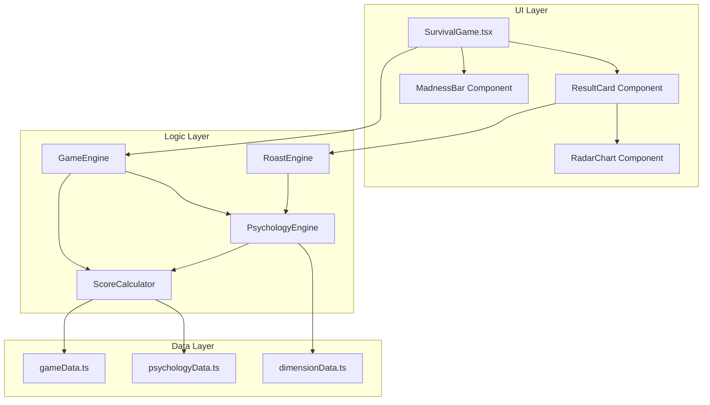

# 韭菜人生升级设计文档

## Overview

本设计文档描述如何将现有的"韭菜人生"心理测试升级为具有深度心理分析功能的 Crypto 心理诊断系统。升级将在保持现有 Windows 风格 UI 和 12 种人格类型的基础上，增加多维度心理分析、疯狂指数、生存评级和详细诊断报告功能。

## Architecture



## Components and Interfaces

### 1. 数据层扩展

#### 扩展 Option 接口
```typescript
// 在现有 Option 基础上扩展
interface EnhancedOption extends Option {
  // 心理维度影响
  dimensions: {
    riskAppetite: number;      // 风险偏好 (-20 to +20)
    emotionalControl: number;  // 情绪控制 (-20 to +20)
    cognitiveBias: number;     // 认知偏差 (-20 to +20)
    socialDependency: number;  // 社交依赖 (-20 to +20)
    greedIndex: number;        // 贪婪指数 (-20 to +20)
  };
  // 疯狂指数影响
  madnessImpact: number; // -10 to +15
}
```

#### 新增心理维度配置
```typescript
interface DimensionConfig {
  id: string;
  name: string;
  description: string;
  warningThreshold: number;
  criticalThreshold: number;
}

const DIMENSIONS: DimensionConfig[] = [
  { id: 'riskAppetite', name: '风险偏好', description: '你对高风险投资的渴望程度', warningThreshold: 60, criticalThreshold: 80 },
  { id: 'emotionalControl', name: '情绪控制', description: '你在市场波动时的情绪稳定性', warningThreshold: 40, criticalThreshold: 20 },
  { id: 'cognitiveBias', name: '认知偏差', description: '你受各种心理偏差影响的程度', warningThreshold: 60, criticalThreshold: 80 },
  { id: 'socialDependency', name: '社交依赖', description: '你依赖他人意见做决策的程度', warningThreshold: 60, criticalThreshold: 80 },
  { id: 'greedIndex', name: '贪婪指数', description: '你对暴富的渴望程度', warningThreshold: 70, criticalThreshold: 85 },
];
```

### 2. 核心计算引擎

#### ScoreCalculator
```typescript
interface ScoreCalculator {
  // 计算传统 Tag 得分（保持兼容）
  calculateTagScores(selectedIds: string[]): Record<TagType, number>;
  
  // 计算心理维度得分
  calculateDimensionScores(selectedIds: string[]): DimensionScores;
  
  // 计算疯狂指数 (0-100)
  calculateMadnessScore(dimensionScores: DimensionScores): number;
  
  // 计算生存评级
  calculateSurvivalRating(madnessScore: number, tagScores: Record<TagType, number>): SurvivalRating;
}
```

#### PsychologyEngine
```typescript
interface PsychologyEngine {
  // 识别核心心理问题
  identifyPsychologicalIssues(dimensionScores: DimensionScores): PsychologicalIssue[];
  
  // 生成改善建议
  generateRecommendations(issues: PsychologicalIssue[]): Recommendation[];
  
  // 生成诊断报告
  generateDiagnosisReport(
    tagScores: Record<TagType, number>,
    dimensionScores: DimensionScores,
    madnessScore: number
  ): DiagnosisReport;
}
```

### 3. UI 组件

#### MadnessBar 组件
实时显示疯狂指数的进度条组件。

```typescript
interface MadnessBarProps {
  score: number;           // 0-100
  animated?: boolean;      // 是否显示动画
  showLabel?: boolean;     // 是否显示文字标签
}
```

#### RadarChart 组件
展示多维度得分的雷达图组件。

```typescript
interface RadarChartProps {
  dimensions: DimensionScores;
  size?: number;
  showLabels?: boolean;
}
```

#### ResultCard 组件（升级版）
```typescript
interface ResultCardProps {
  result: Result;                    // 现有人格结果
  madnessScore: number;              // 疯狂指数
  survivalRating: SurvivalRating;    // 生存评级
  dimensionScores: DimensionScores;  // 维度得分
  tagDistribution: TagDistribution;  // Tag 分布
  recommendations: Recommendation[]; // 改善建议
}
```

## Data Models

### 核心数据类型

```typescript
// 维度得分
interface DimensionScores {
  riskAppetite: number;      // 0-100
  emotionalControl: number;  // 0-100
  cognitiveBias: number;     // 0-100
  socialDependency: number;  // 0-100
  greedIndex: number;        // 0-100
}

// 生存评级
type SurvivalRating = 
  | '韭菜'           // madness >= 80
  | '老韭菜'         // madness 60-79
  | '韭菜王'         // madness 40-59
  | '镰刀预备役'     // madness 20-39
  | '终极镰刀';      // madness < 20

// 心理问题
interface PsychologicalIssue {
  id: string;
  name: string;
  severity: 'mild' | 'moderate' | 'severe';
  description: string;
  relatedDimensions: string[];
}

// 改善建议
interface Recommendation {
  issueId: string;
  title: string;
  description: string;
  actionItems: string[];
}

// 诊断报告
interface DiagnosisReport {
  personalityType: Result;
  madnessScore: number;
  survivalRating: SurvivalRating;
  dimensionScores: DimensionScores;
  tagDistribution: Record<TagType, number>;
  issues: PsychologicalIssue[];
  recommendations: Recommendation[];
  shareText: string;
}

// Tag 分布
interface TagDistribution {
  [key: string]: {
    count: number;
    percentage: number;
  };
}
```

### Tag 类型与维度映射

```typescript
const TAG_DIMENSION_MAPPING: Record<TagType, Partial<DimensionScores>> = {
  degen: { riskAppetite: 15, emotionalControl: -10, greedIndex: 12 },
  rekt: { riskAppetite: -5, emotionalControl: -15, cognitiveBias: 10 },
  holder: { riskAppetite: -5, emotionalControl: 10, greedIndex: -5 },
  slave: { socialDependency: 8, emotionalControl: -8, greedIndex: 5 },
  shark: { riskAppetite: 10, emotionalControl: 15, cognitiveBias: -5 },
  normie: { riskAppetite: -10, socialDependency: 12, cognitiveBias: 5 },
  midcurve: { cognitiveBias: 15, emotionalControl: -5, socialDependency: -5 },
  simp: { socialDependency: 18, emotionalControl: -8, cognitiveBias: 10 },
  maxi: { riskAppetite: 12, cognitiveBias: 15, socialDependency: -10 },
  larper: { socialDependency: 10, cognitiveBias: 8, greedIndex: 8 },
  dev: { riskAppetite: 8, emotionalControl: 5, cognitiveBias: -8 },
  npc: { socialDependency: 15, emotionalControl: -5, cognitiveBias: 12 },
};
```


## Correctness Properties

*A property is a characteristic or behavior that should hold true across all valid executions of a system-essentially, a formal statement about what the system should do. Properties serve as the bridge between human-readable specifications and machine-verifiable correctness guarantees.*

Based on the prework analysis, the following properties have been identified for testing:

### Property 1: Dual Score Calculation
*For any* selection of options, the system should calculate both traditional Tag scores and multi-dimensional psychology scores simultaneously.
**Validates: Requirements 1.2**

### Property 2: Madness Score Range
*For any* combination of selected options, the calculated Madness_Score must be within the range of 0-100.
**Validates: Requirements 1.3**

### Property 3: Survival Rating Mapping
*For any* valid Madness_Score (0-100), the system must return a valid SurvivalRating from the set {韭菜, 老韭菜, 韭菜王, 镰刀预备役, 终极镰刀}.
**Validates: Requirements 1.4**

### Property 4: Tag Dimension Impact
*For any* option with a specific tag type (degen, rekt, slave, shark, etc.), selecting that option should modify the corresponding dimension scores within the defined ranges.
**Validates: Requirements 2.1, 2.2, 2.3, 2.4**

### Property 5: Complete Dimension Calculation
*For any* combination of selected options, the system must return scores for all four core dimensions (riskAppetite, emotionalControl, cognitiveBias, socialDependency).
**Validates: Requirements 2.5**

### Property 6: Diagnosis Report Completeness
*For any* completed assessment, the generated DiagnosisReport must contain at least 5 dimension scores.
**Validates: Requirements 3.1**

### Property 7: Issue-Recommendation Pairing
*For any* identified PsychologicalIssue, the system must generate at least one corresponding Recommendation.
**Validates: Requirements 3.5**

### Property 8: Tag Distribution Sum
*For any* set of selected options, the sum of all Tag type percentages in the distribution must equal 100%.
**Validates: Requirements 4.4**

### Property 9: Share Text Generation
*For any* valid DiagnosisReport, the system must generate a non-empty share text containing the madness score, personality type, and survival rating.
**Validates: Requirements 4.5**

### Property 10: Warning State Threshold
*For any* Madness_Score greater than 70, the UI progress bar must display in warning (red) state.
**Validates: Requirements 5.3**

### Property 11: Option Dimension Completeness
*For any* EnhancedOption in the system, it must have a valid dimensions object with all required fields.
**Validates: Requirements 6.4**

### Property 12: Top Issues Limit
*For any* dimension scores combination, the system must identify at most 3 psychological issues as the most prominent.
**Validates: Requirements 7.1**

### Property 13: Recommendation Count Per Issue
*For any* identified PsychologicalIssue, the system must provide 2-3 specific improvement recommendations.
**Validates: Requirements 7.2**

### Property 14: Calculate Result Compatibility
*For any* valid array of selected option IDs, the existing calculateResult function must return a valid Result object from the 12 personality types.
**Validates: Requirements 8.2**

## Error Handling

### Input Validation
- Empty selection arrays should return default/neutral scores
- Invalid option IDs should be ignored without crashing
- Out-of-range dimension values should be clamped to valid ranges

### Calculation Errors
- Division by zero in percentage calculations should return 0
- Missing dimension mappings should use default values
- Null/undefined options should be filtered out

### UI Error States
- Failed chart rendering should show fallback text display
- Missing result data should show "计算中..." placeholder
- Network errors for share functionality should show retry option

## Testing Strategy

### Property-Based Testing Library
使用 **fast-check** 作为 TypeScript 的属性测试库。

### Unit Tests
- ScoreCalculator 各方法的边界值测试
- PsychologyEngine 问题识别逻辑测试
- RoastEngine 建议生成测试
- UI 组件渲染测试

### Property-Based Tests
每个 Correctness Property 将实现为独立的属性测试，配置运行至少 100 次迭代。

测试文件结构：
```
src/
  __tests__/
    scoreCalculator.test.ts      // Properties 1, 2, 5, 8
    survivalRating.test.ts       // Property 3
    dimensionImpact.test.ts      // Property 4
    diagnosisReport.test.ts      // Properties 6, 7, 9
    uiState.test.ts              // Property 10
    dataIntegrity.test.ts        // Properties 11, 14
    recommendations.test.ts      // Properties 12, 13
```

### Test Annotation Format
每个属性测试必须使用以下格式标注：
```typescript
// **Feature: crypto-survival-upgrade, Property 2: Madness Score Range**
// **Validates: Requirements 1.3**
```
